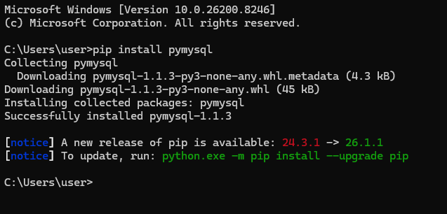
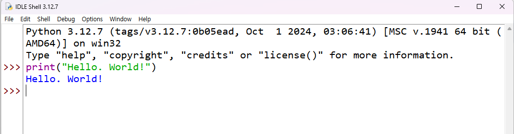
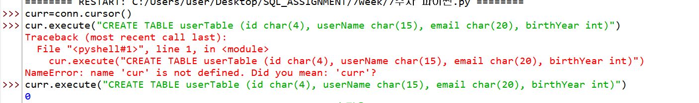
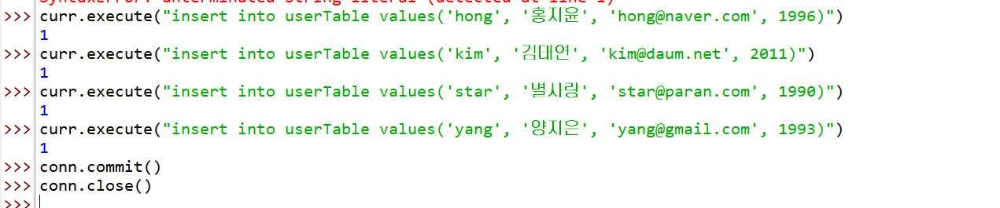
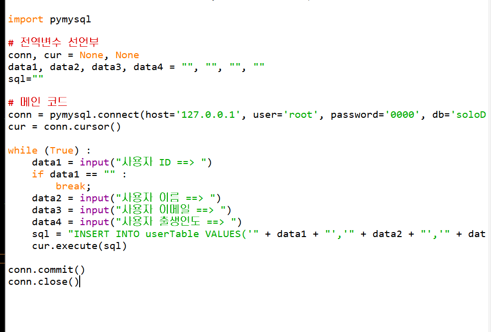
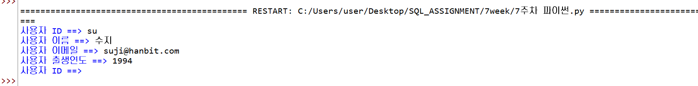
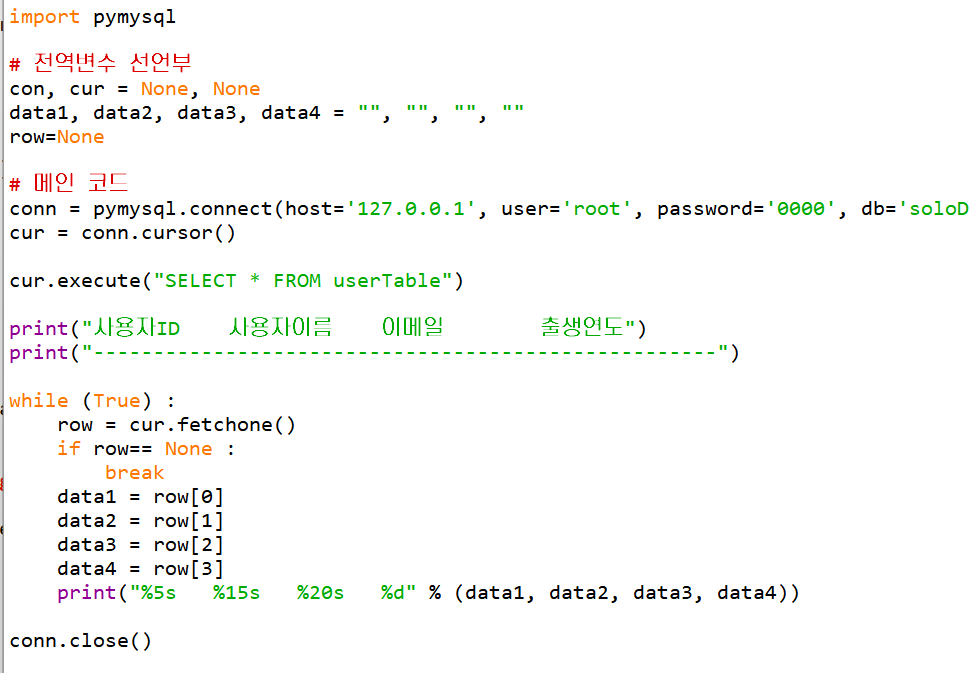
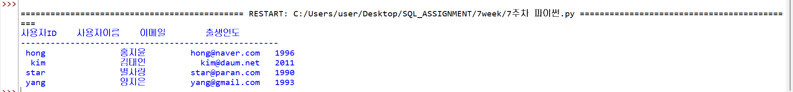

# SQL_ADVANCED 7주차 정규 과제 

📌SQL_ADVANCED 정규과제는 매주 정해진 분량의 『*혼자 공부하는 SQL*』 을 읽고 학습하는 것입니다. 이번주는 아래의 **SQL_ADVANCED_7th_TIL**에 나열된 분량을 읽고 공부하시면 됩니다.

아래의 문제를 풀어보며 학습 내용을 점검하세요. 문제를 해결하는 과정에서 개념을 스스로 정리하고, 필요한 경우 제시된 강의를 참고하여 보완하는 것이 좋습니다.

<!-- 강의 링크는 아래와 같습니다.
https://www.youtube.com/watch?v=KZmW6VaY5BU&list=PLVsNizTWUw7GCfy5RH27cQL5MeKYnl8Pm&index=16
https://www.youtube.com/watch?v=vWTDuoSG-YQ&list=PLVsNizTWUw7GCfy5RH27cQL5MeKYnl8Pm&index=17
https://www.youtube.com/watch?v=aiMSluMNzI8&list=PLVsNizTWUw7GCfy5RH27cQL5MeKYnl8Pm&index=18
-->

**교재 실습 예제 파일은 07_SQL_ADVANCED_Template 레포지토리의 src 폴더에 업로드되어 있습니다. market_db 파일도 해당 폴더에 함께 포함되어 있으니 참고하시기 바랍니다.**

**👀(수행 인증샷은 필수입니다.)** 

## SQL_ADVANCED_7th_TIL

### 8장 SQL과 파이썬 연결 
#### 01. 파이썬 개발 환경 준비
#### 02. 파이썬과 MySQL의 연동
#### 03. GUI 응용 프로그램 

## Study Schedule

| 주차  | 공부 범위     | 완료 여부 |
| ----- | ------------- | --------- |
| 1주차 | p.24~99    | ✅         |
| 2주차 | p.102~155   | ✅         |
| 3주차 | p.158~213  | ✅         |
| 4주차 | p.216~271 | ✅         |
| 5주차 | p.274~327 | ✅         |
| 6주차 | p.330~369 | ✅         |
| 7주차 | p.372~407 | ✅         |

 

<!-- 여기까진 그대로 둬 주세요-->

---

# 1️⃣ 학습 내용 정리

## 1. 파이썬 개발 환경 준비

<!-- 이번 챕터에서 제시된 실습을 흐름에 맞게 진행한 후, 실습 과정이 보일 수 있도록 인증 사진을 2장 이상 제출해 주세요. -->

## 2. 파이썬과 MySQL의 연동

<!-- 이번 챕터에서 제시된 실습을 흐름에 맞게 진행한 후, 실습 과정이 보일 수 있도록 인증 사진을 2장 이상 제출해 주세요. -->

## 3. GUI 응용 프로그램 

<!-- GUI 응용 프로그램에 관해 배우게 된 점을 적어주세요. -->

1. GUI 개념
- 텍스트 대신 창, 버튼 같은 그래픽으로 프로그램을 조작하는 환경임.
- SQL 명령어를 몰라도 마우스 클릭만으로 데이터베이스를 쉽게 다룰 수 있게 해줌.

2. tkinter 기본 프로그래밍
- 파이썬에서 GUI 화면을 만들 때 제공되는 기본 라이브러리임.
- from tkinter import *: tkinter의 모든 기능을 불러옴.
- root = Tk(): 가장 바탕이 되는 기본 창(루트 윈도우)을 생성함.
- root.mainloop(): 화면에 창을 계속 띄워두고 마우스 클릭 같은 이벤트를 기다림.

3. 주요 화면 구성 요소
- 라벨: 화면에 글자를 표시함.
- 버튼: 마우스로 클릭하는 기능을 제공함.
- 프레임: 화면의 구역을 나눔.
- 엔트리: 사용자가 글자를 입력할 수 있는 상자임.
- 리스트 박스: 여러 개의 데이터 목록을 한 번에 보여줌.

---

이번 주는 마지막 주로 별도의 실습 과제는 진행하지 않습니다.

한 학기 동안 다소 부족한 커리큘럼이었음에도 불구하고 성실하게, 그리고 열심히 과제를 수행해주셔서 진심으로 감사드립니다.

이번 과정을 통해 배운 내용이 앞으로 여러분이 SQL을 다루는 데에 조금이나마 도움이 되기를 바랍니다.

여러분의 앞날을 진심으로 응원합니다. 😊

### 🎉 수고하셨습니다.

