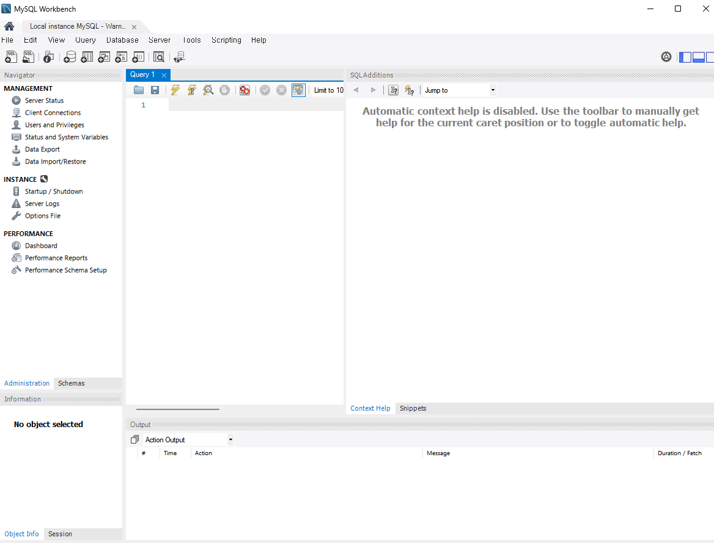
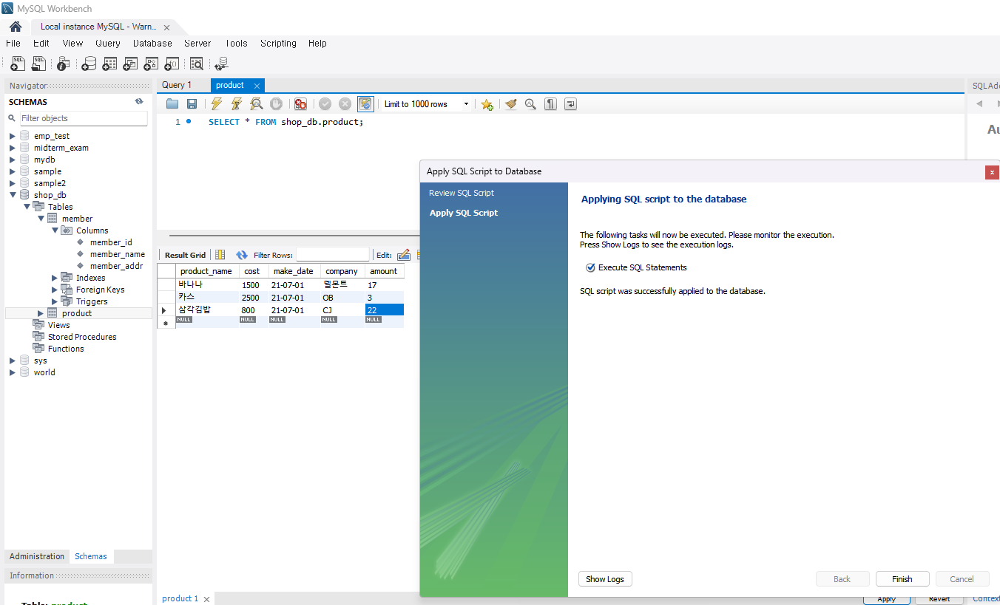
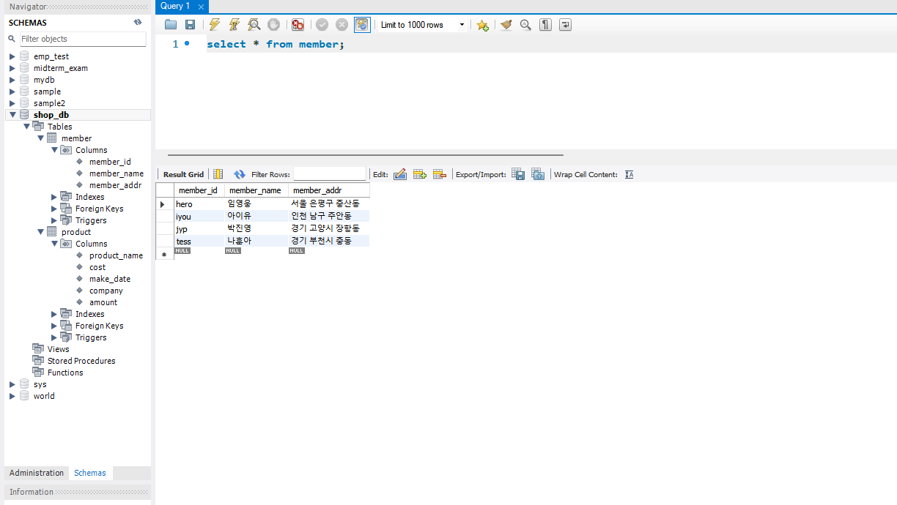
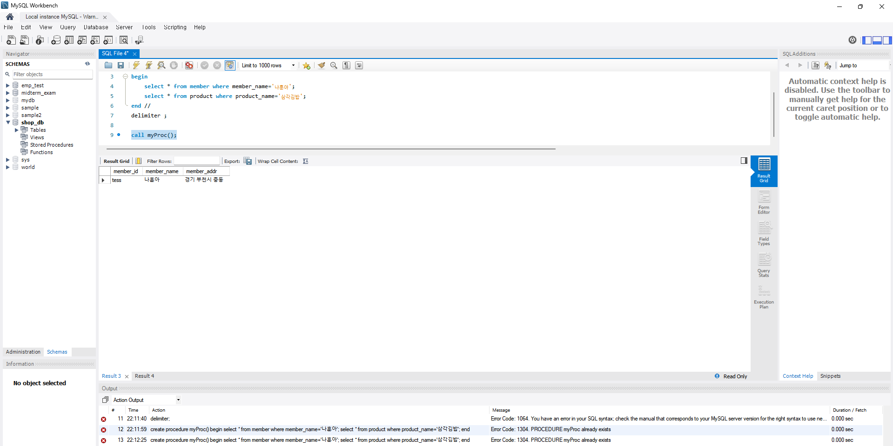

# SQL_ADVANCED 1주차 정규 과제 

📌SQL_ADVANCED 정규과제는 매주 정해진 분량의 『*혼자 공부하는 SQL*』 을 읽고 학습하는 것입니다. 이번주는 아래의 **SQL_ADVANCED_1st_TIL**에 나열된 분량을 읽고 공부하시면 됩니다.

아래의 문제를 풀어보며 학습 내용을 점검하세요. 문제를 해결하는 과정에서 개념을 스스로 정리하고, 필요한 경우 제시된 강의를 참고하여 보완하는 것이 좋습니다.

<!-- 강의 링크는 아래와 같습니다.
https://www.youtube.com/watch?v=0cRhit1EJM0&list=PLVsNizTWUw7GCfy5RH27cQL5MeKYnl8Pm&index=1
https://www.youtube.com/watch?v=6JFEJWLcKUc&list=PLVsNizTWUw7GCfy5RH27cQL5MeKYnl8Pm&index=2
https://www.youtube.com/watch?v=8r1W_7nuo2U&list=PLVsNizTWUw7GCfy5RH27cQL5MeKYnl8Pm&index=3
https://www.youtube.com/watch?v=j2DAiY-OXGs&list=PLVsNizTWUw7GCfy5RH27cQL5MeKYnl8Pm&index=4
https://www.youtube.com/watch?v=EftIRlr6rPI&list=PLVsNizTWUw7GCfy5RH27cQL5MeKYnl8Pm&index=5
https://www.youtube.com/watch?v=lBk5YhLZevs&list=PLVsNizTWUw7GCfy5RH27cQL5MeKYnl8Pm&index=6
-->

**교재 실습 예제 파일은 07_SQL_ADVANCED_Template 레포지토리의 src 폴더에 업로드되어 있습니다. market_db 파일도 해당 폴더에 함께 포함되어 있으니 참고하시기 바랍니다.**

**👀(수행 인증샷은 필수입니다.)** 

## SQL_ADVANCED_1st_TIL

### 1장 데이터베이스와 SQL
#### 01. 데이터베이스 알아보기
#### 02. MySQL 설치하기
### 2장 실전용 SQL 미리 맛보기
#### 01. 건물을 짓기 위한 설계도: 데이터베이스 모델링
#### 02. 데이터베이스 시작부터 끝까지
#### 03. 데이터베이스 개체 


## Study Schedule

| 주차  | 공부 범위     | 완료 여부 |
| ----- | ------------- | --------- |
| 1주차 | p.24~99    | ✅         |
| 2주차 | p.102~155   | 🍽️         |
| 3주차 | p.158~213  | 🍽️         |
| 4주차 | p.216~271 | 🍽️         |
| 5주차 | p.274~327 | 🍽️         |
| 6주차 | p.330~369 | 🍽️         |
| 7주차 | p.372~407 | 🍽️         |


<br>

<!-- 여기까진 그대로 둬 주세요-->

---

# 1️⃣ 학습 내용 정리

## 1. 데이터베이스 알아보기

<!-- 데이터베이스와 DBMS에 관해 배우게 된 점을 적어주세요. -->
데이터베이스는 데이터들의 집합이다. 오늘날 우리가 활용하고 소비하는 모든 정보들은 다 데이터베이스에 정보가 저장되고 관리된다. 이러한 데이터베이스를 관리하고 운영하는 소프트웨어를 DBMS라고 한다. DBMS의 가장 큰 특징은 대용량의 데이터를 관리할 수 있어야 하며, 여러 사용자와 공유할 수 있어야 한다는 점이다.
DBMS 소프트웨어의 종류에는 MySQL, MariaDB 등 여러 가지가 있다.
DBMS가 생기기 이전에는 직접 종이에 데이터를 정리하거나, 컴퓨터의 메모장, 엑셀 등을 활용하여 데이터를 관리했었다. 그러다가 DBMS가 대두가 되었고 1970년대부터 본격적으로 보급되기 시작했다. 다음으로 DBMS의 종류에는 계층형, 망형, 관계형이 있다. 오늘날에는 관계형 DBMS를 주로 사용하며, 관계형 DBMS의 가장 기본 단위는 테이블이다.  

> **확인문제: 다음 소프트웨어 중에서 DBMS가 아닌 것을 모두 고르세요.**

> MySQL / Excel / Oracle / SQL Server / MariaDB

```
Excel
```


## 2. MySQL 설치하기

<!-- 이번 챕터는 개념정리 없이 MySQL 설치 후 인증사진으로 대체합니다. -->



## 3. 건물을 짓기 위한 설계도: 데이터베이스 모델링

<!-- 데이터베이스 모델링에 관해 배우게 된 점을 적어주세요. -->
데이터베이스를 구축하기 위해 데이터베이스 모델링이라고 불리는 설계 과정이 필요하다. 데이터베이스 모델링은 현실 세계에서의 작업을 DBMS의 데이터베이스 개체로 옮기기 위해 테이블들을 결정하는 과정을 말한다. 이러한 모델링의 결과로 나오는 테이블은 열(컬럼), 행(로우), 기본 키 등으로 구성되어 있다. 기본키는 각각의 행을 구분하는 유일한 값이다. 기본키는 열을 대상으로 지정하는 것이며, null 값이면 안되고, 같은 값이 2개 있어도 안된다.

> **확인문제: 다음은 폭포수 모델의 절차입니다. 차례대로 나열해보세요.**

> 시스템 설계 / 테스트 / 프로그램 구현 / 프로젝트 계획 / 업무 분석 / 유지보수

```
프로젝트 계획, 업무 분석, 시스템 설계, 프로그램 구현, 테스트, 유지보수
```


## 4. 데이터베이스 시작부터 끝까지 

<!-- 이번 챕터는 개념정리 없이 실습 인증사진으로 대체합니다. 강의를 수강하고, 실습 과정이 보이도록 인증사진 3-4장을 아래에 제출해주세요. -->







## 5. 데이터베이스 개체

<!-- 데이터베이스 개체에 관해 배우게 된 점을 적어주세요. -->
테이블 말고도 데이터베이스의 핵심 개체에는 인덱스, 뷰, 스토어드 프로시저, 트리거, 함수 등이 있다.

인덱스는 데이터를 빠르게 조회할 수 있게끔 해주는 개체이다. 특히 실무에서 대용량의 데이터를 다뤄야 할 때 주로 사용된다. 뷰는 실체가 없는 가상의 테이블을 말한다. 뷰는 본래 테이블에서 select문을 통해 추출해낸 부분만큼을 가져온 것이며, 사용자가 접근할 때는 테이블을 접근하는 것과 유사하다고 볼 수 있다. 스토어드 프로시저는 sql 안에서도 일반 프로그래밍 언어처럼 코딩을 할 수 있게끔 해준다. 이를테면 코딩할 때 쓰이는 조건문 if, 반복문 등을 사용할 수 있게 되는 것이다. 

<!-- 인덱스, 뷰, 스토어드 프로시저 실습을 각각 진행한 후, 각 실습에 대한 인증 사진을 1장씩 제출해 주세요. -->



---

# 2️⃣ 실습과제

> SQL ADVANCED 과정은 별도의 확인문제가 없습니다. 다음 주부터는 확인문제 대신 제공되는 실습용 테이블을 활용하여, 배운 내용을 직접 적용하는 실습형 과제로 진행됩니다.

> 이번주는 개강과 함께 새로운 학기가 시작된 만큼, 학기 초 일정에 천천히 적응하시며 부담 없는 한 주 보내시길 바랍니다. 😊

### 🎉 수고하셨습니다.


