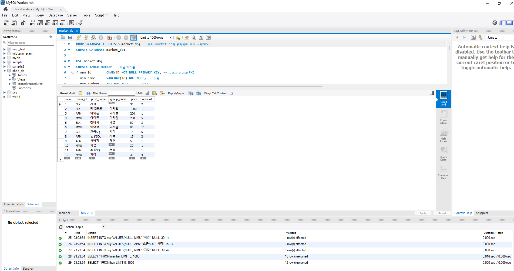
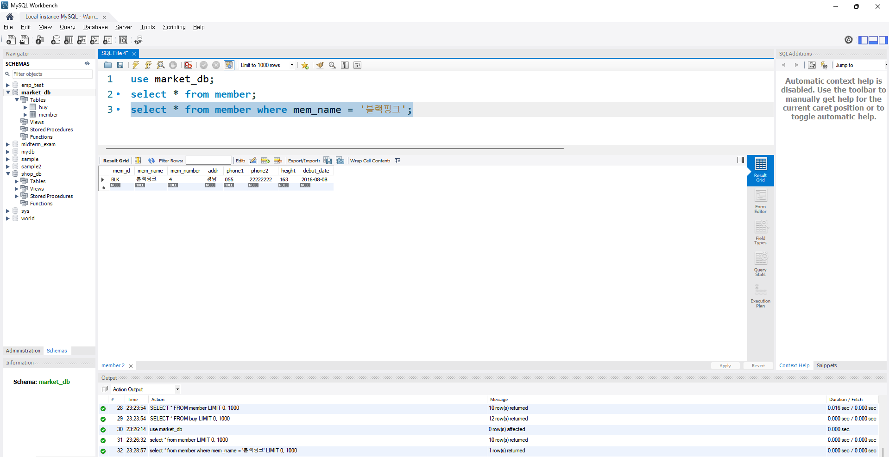
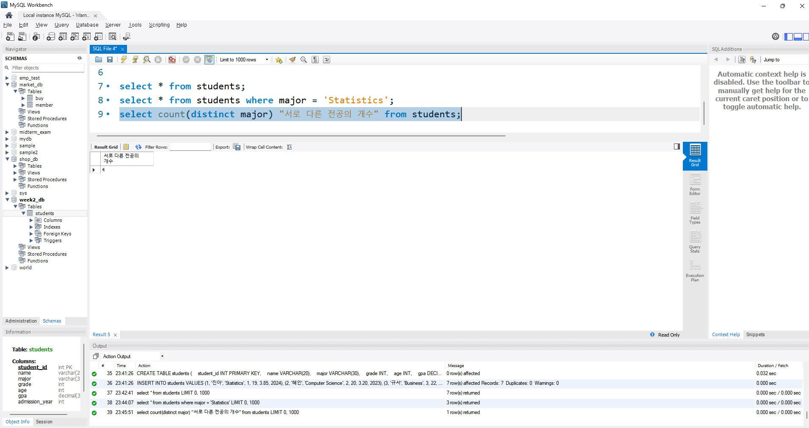
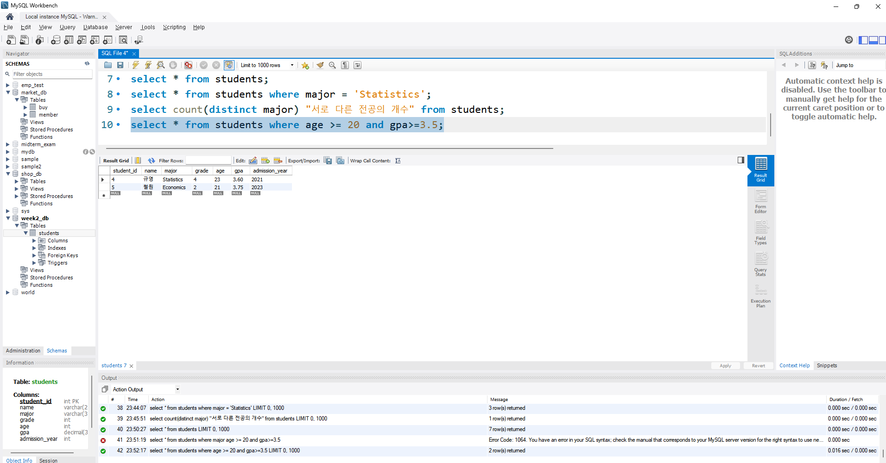

# SQL_ADVANCED 2주차 정규 과제 

📌SQL_ADVANCED 정규과제는 매주 정해진 분량의 『*혼자 공부하는 SQL*』 을 읽고 학습하는 것입니다. 이번주는 아래의 **SQL_ADVANCED_2nd_TIL**에 나열된 분량을 읽고 공부하시면 됩니다.

아래의 문제를 풀어보며 학습 내용을 점검하세요. 문제를 해결하는 과정에서 개념을 스스로 정리하고, 필요한 경우 제시된 강의를 참고하여 보완하는 것이 좋습니다.

<!-- 강의 링크는 아래와 같습니다.
https://www.youtube.com/watch?v=_JURyg_KzHE&list=PLVsNizTWUw7GCfy5RH27cQL5MeKYnl8Pm&index=7
https://www.youtube.com/watch?v=6qkPy7RfLqQ&list=PLVsNizTWUw7GCfy5RH27cQL5MeKYnl8Pm&index=8
https://www.youtube.com/watch?v=WWAFAm9op2U&list=PLVsNizTWUw7GCfy5RH27cQL5MeKYnl8Pm&index=9
-->

**교재 실습 예제 파일은 07_SQL_ADVANCED_Template 레포지토리의 src 폴더에 업로드되어 있습니다. market_db 파일도 해당 폴더에 함께 포함되어 있으니 참고하시기 바랍니다.**

**👀(수행 인증샷은 필수입니다.)** 

## SQL_ADVANCED_2nd_TIL

### 3장 SQL 기본 문법
#### 01. 기본 중에 기본 SELECT ~ FROM ~ WHERE
#### 02. 좀 더 깊게 알아보는 SELECT문
#### 03. 데이터 변경을 위한 SQL문


## Study Schedule

| 주차  | 공부 범위     | 완료 여부 |
| ----- | ------------- | --------- |
| 1주차 | p.24~99    | ✅         |
| 2주차 | p.102~155   | ✅         |
| 3주차 | p.158~213  | 🍽️         |
| 4주차 | p.216~271 | 🍽️         |
| 5주차 | p.274~327 | 🍽️         |
| 6주차 | p.330~369 | 🍽️         |
| 7주차 | p.372~407 | 🍽️         |


<br>

<!-- 여기까진 그대로 둬 주세요-->

---

# 1️⃣ 학습 내용 정리

## 1. 기본 중에 기본 SELECT ~ FROM ~ WHERE

<!-- 기본적인 SQL 문법에 관해 배우게 된 점을 적어주세요. -->

select문은 구축이 완료된 테이블에서 데이터를 추출할 때 쓰는 명령어이다. select의 가장 기본적인 형식은 select ~ from ~ where이다. 
USE는 데이터베이스를 선택할 때 사용하며, DROP DATABASE는 데이터베이스를 삭제하는 명령어다. 데이터를 입력하는 명령어는 INSERT이다며, 특정 조건만 지정해서 select 할 때는 where을 쓴다.

<!-- 이번 챕터에서 제시된 실습을 흐름에 맞게 진행한 후, 실습 과정이 보일 수 있도록 인증 사진을 3~4장 제출해 주세요. -->






> **확인문제: 다음 SQL문의 빈칸에 들어갈 WHERE절의 문법으로 틀린 것을 고르세요.**

```sql
SELECT *
FROM table_name
WHERE ________;
```

보기는 아래와 같습니다.
```
1. mem_number == 4
2. mem_number >= 4
3. mem_number <= 4
4. mem_number = 4
```

```
１
```


## 2. 좀 더 깊게 알아보는 SELECT문

<!-- ORDER BY절과 GROUP BY절에 관해 배우게 된 점을 적어주세요. -->

ORDER BY 절은 기본적으로 데이터를 오름차순으로 정렬하며, 내림차순 정렬을 위해서는 DESC를 명시해야 한다. 또한 쉼표를 통해 여러 개의 정렬 기준을 두어 세밀한 조회가 가능하고, LIMIT 절과 함께 사용하여 상위 데이터만 추출할 수도 있는데, 이때 ORDER BY 절은 반드시 WHERE 절 뒤에 작성해야 문법적 오류가 발생하지 않는다. 이와 더불어 GROUP BY 절을 사용하면 특정 기준에 따라 데이터를 그룹화할 수 있으며, 주로 SUM이나 AVG, COUNT 등의 집계 함수와 함께 활용된다. 여기서 COUNT 함수는 괄호 안에 컬럼명을 지정하면 빈칸을 제외하고 개수를 세지만, 별표를 넣으면 빈칸을 포함한 전체 행의 개수를 센다는 중요한 차이가 있다. 특히 그룹화된 결과에 조건을 걸어 필터링할 때는 WHERE가 아닌 반드시 HAVING 절을 사용해야 해야 한다.

> **확인문제: 다음 표는 주요 집계함수를 정리한 것입니다. 각 설명에 해당하는 올바른 함수명을 기호에 맞게 작성하세요.**

| 함수명 | 설명 |
|--------|------|
| SUM() | 합계를 구합니다. |
| (ㄱ) | 평균을 구합니다. |
| (ㄴ) | 최소값을 구합니다. |
| MAX() | 최대값을 구합니다. |
| (ㄷ) | 행의 개수를 셉니다. |
| (ㄹ) | 행의 개수를 셉니다 (중복은 1개만 인정). |

```
여기에 답을 적어주세요!
(ㄱ) AVG
(ㄴ) MIN
(ㄷ) COUNT
(ㄹ) COUNT(DISTINCT)
```


## 3. 데이터 변경을 위한 SQL문

<!-- INSERT문, UPDATE문, DELETE문에 관해 배우게 된 점을 적어주세요. -->

테이블에 새로운 행을 추가하는 INSERT 문은 지정한 열 이름의 개수와 입력할 데이터 값의 개수 및 형식이 정확히 일치해야 하며, 모든 열에 값을 넣을 때는 열 이름을 굳이 적지 않고 생략할 수 있어 편리하다는 점을 배웠다. 기존에 입력된 데이터를 수정할 때 사용하는 UPDATE 문은 SET 절을 이용해 변경할 값을 지정하는데, 이때 특정 조건을 걸어주는 WHERE 절을 빼먹으면 테이블 내의 모든 행이 한꺼번에 수정되는 치명적인 실수를 범할 수 있으므로 각별한 주의가 필요함을 깨달았다. 마지막으로 테이블의 데이터를 행 단위로 삭제하는 DELETE 문 역시 WHERE 절을 통해 원하는 조건의 데이터만 골라서 지울 수 있으며, 전체 데이터를 한 번에 비우는 TRUNCATE 같은 명령어들과 달리 데이터를 하나씩 지우기 때문에 대용량 데이터를 다룰 때는 처리 속도가 상대적으로 느리다.

> **확인문제: 다음이 설명하는 SQL이 무엇인지 쓰세요.**

```
* 데이터를 삭제합니다.
* DELETE와 동일한 효과를 내지만 속도가 무척 빠릅니다.
* 삭제 후에 빈 테이블이 남아 있습니다.
```

```
TRUNCATE
```


---

# 2️⃣ 실습과제

## 1. 데이터베이스 구축

아래 코드를 MySQL Workbench에 붙여넣은 후,  
**전체 드래그 → 실행 (Ctrl + shift + Enter)** 하여 데이터베이스를 구축하세요.

```sql
-- 1. 데이터베이스 생성
CREATE DATABASE IF NOT EXISTS week2_db;

-- 2. 사용할 데이터베이스 선택
USE week2_db;

-- 4. 테이블 생성
CREATE TABLE students (
    student_id INT PRIMARY KEY,
    name VARCHAR(20),
    major VARCHAR(30),
    grade INT,
    age INT,
    gpa DECIMAL(3,2),
    admission_year INT
);

-- 5. 데이터 삽입
INSERT INTO students VALUES
(1, '진아', 'Statistics', 1, 19, 3.85, 2024),
(2, '혜인', 'Computer Science', 2, 20, 3.20, 2023),
(3, '규서', 'Business', 3, 22, 2.95, 2022),
(4, '규영', 'Statistics', 4, 23, 3.60, 2021),
(5, '철원', 'Economics', 2, 21, 3.75, 2023),
(6, '예운', 'Computer Science', 1, 19, 3.10, 2024),
(7, '민서', 'Statistics', 3, 22, 3.45, 2022);
```
## 2. 실습 문제

다음 SQL 문을 작성하고 실행 결과를 확인 후 인증 사진을 아래에 업로드하세요.

1. 모든 학생의 정보를 조회하시오.
2. 전공이 'Statistics'인 학생을 조회하시오.
3. 현재 students 테이블에 존재하는 서로 다른 전공의 개수를 구하시오.
4. 나이가 20 이상이고 GPA가 3.5 이상인 학생을 조회하시오.
5. students 테이블에 본인의 정보를 직접 INSERT 하시오. (INSERT 실행 후, 데이터가 정상적으로 추가되었는지 확인할 수 있도록 조회 결과까지 포함하여 캡처하시오.)







### 🎉 수고하셨습니다.