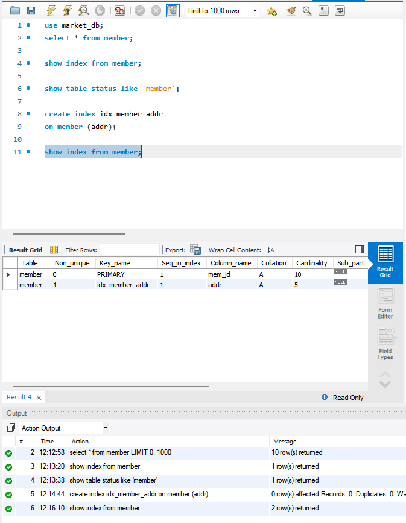
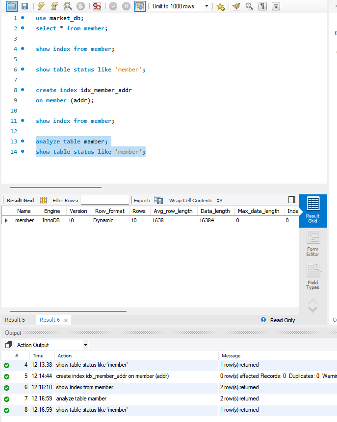
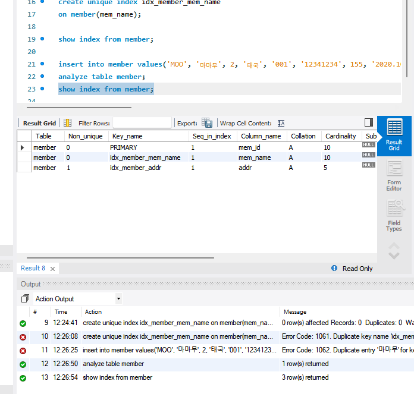
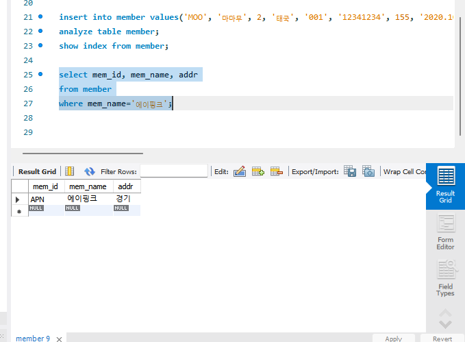
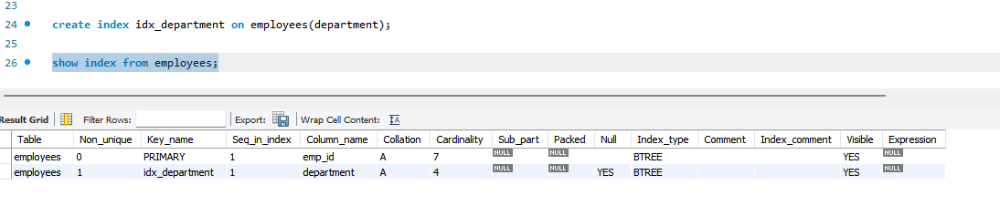
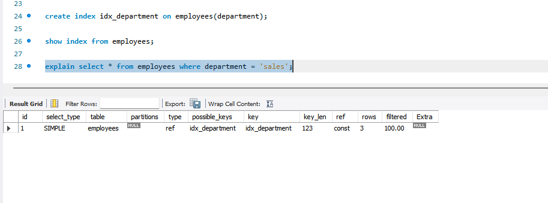
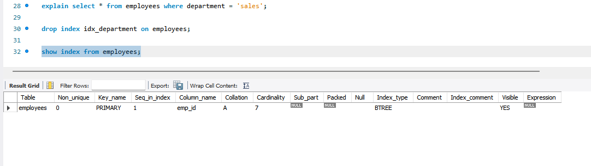

# SQL_ADVANCED 5주차 정규 과제 

📌SQL_ADVANCED 정규과제는 매주 정해진 분량의 『*혼자 공부하는 SQL*』 을 읽고 학습하는 것입니다. 이번주는 아래의 **SQL_ADVANCED_5th_TIL**에 나열된 분량을 읽고 공부하시면 됩니다.

아래의 문제를 풀어보며 학습 내용을 점검하세요. 문제를 해결하는 과정에서 개념을 스스로 정리하고, 필요한 경우 제시된 강의를 참고하여 보완하는 것이 좋습니다.

<!-- 강의 링크는 아래와 같습니다.
https://www.youtube.com/watch?v=KZmW6VaY5BU&list=PLVsNizTWUw7GCfy5RH27cQL5MeKYnl8Pm&index=16
https://www.youtube.com/watch?v=vWTDuoSG-YQ&list=PLVsNizTWUw7GCfy5RH27cQL5MeKYnl8Pm&index=17
https://www.youtube.com/watch?v=aiMSluMNzI8&list=PLVsNizTWUw7GCfy5RH27cQL5MeKYnl8Pm&index=18
-->

**교재 실습 예제 파일은 07_SQL_ADVANCED_Template 레포지토리의 src 폴더에 업로드되어 있습니다. market_db 파일도 해당 폴더에 함께 포함되어 있으니 참고하시기 바랍니다.**

**👀(수행 인증샷은 필수입니다.)** 

## SQL_ADVANCED_5th_TIL

### 6장 인덱스
#### 01. 인덱스 개념을 파악하자
#### 02. 인덱스의 내부 작동
#### 03. 인덱스의 실제 사용  


## Study Schedule

| 주차  | 공부 범위     | 완료 여부 |
| ----- | ------------- | --------- |
| 1주차 | p.24~99    | ✅         |
| 2주차 | p.102~155   | ✅         |
| 3주차 | p.158~213  | ✅         |
| 4주차 | p.216~271 | ✅         |
| 5주차 | p.274~327 | ✅         |
| 6주차 | p.330~369 | 🍽️         |
| 7주차 | p.372~407 | 🍽️         |


<br>

<!-- 여기까진 그대로 둬 주세요-->

---

# 1️⃣ 학습 내용 정리

## 1. 인덱스 개념을 파악하자 

<!-- 인덱스에 관해 배우게 된 점을 적어주세요. -->

1. 인덱스의 기본 개념과 장단점
- 개념: 데이터를 빠르게 찾도록 도와주는 기능임 (SELECT 문 속도 향상).
- 장점: 검색 속도가 매우 빨라지고, 컴퓨터 시스템의 부담을 줄여 전체 성능이 향상됨.
- 단점: 추가 저장 공간(테이블 크기의 약 10%)과 처음 생성할 때 작업 시간이 필요함. 특히 데이터가 자주 변경(INSERT, UPDATE, DELETE)되는 곳에 쓰면 오히려 성능이 나빠짐.

2. 클러스터형 vs 보조 인덱스
클러스터형 인덱스 (Clustered Index)
- 기준: 기본 키(Primary Key) 지정 시 자동 생성됨.
- 정렬: 지정된 열을 기준으로 데이터 자체가 자동 정렬됨.
- 개수: 테이블당 딱 1개만 생성 가능함.

보조 인덱스 (Secondary Index)
- 기준: 고유 키(Unique) 지정 시 자동 생성됨.
- 정렬: 별도 공간에 인덱스가 생기며 원본 데이터는 자동 정렬되지 않음 (비유: 일반 책 뒤의 찾아보기).
- 개수: 테이블당 여러 개 생성 가능함.

> **확인문제: 다음은 인덱스 종류와 관련된 설명입니다. 가장 거리가 먼 것을 하나 고르세요.**

보기는 아래와 같습니다.
```
1️⃣ 클러스터형 인덱스는 영어사전과 비슷한 개념입니다.
2️⃣ 보조 인덱스는 일반 책의 찾아보기와 비슷한 개념입니다.
3️⃣ 클러스터형 인덱스는 기본 키를 설정하면 자동 생성됩니다.
4️⃣ 보조 인덱스는 NOT NULL을 설정하면 자동 생성됩니다.
```

```
4번. 보조 인덱스는 NOT NULL이 아니라 고유 키를 설정할 때 자동으로 생성되기 때문임.
```


## 2. 인덱스의 내부 작동 

<!-- 인덱스의 내부 작동에 관해 배우게 된 점을 적어주세요. -->

1. 인덱스의 내부 구조: 균형 트리
- 인덱스는 내부적으로 나무를 거꾸로 뒤집은 형태인 균형 트리 구조로 이루어짐.
- 데이터가 저장되는 기본 공간을 노드라고 하며, MySQL에서는 이를 페이지라고 부름.

2. 검색 속도가 빠른 이유
- 인덱스가 없으면 처음부터 끝까지 무식하게 다 뒤지는 전체 테이블 검색을 해야 함.
- 인덱스가 있으면 가장 상위의 루트 페이지에서 시작해 정렬된 길을 따라 데이터가 있는 리프 페이지로 곧바로 찾아가므로 읽는 양이 확 줄어듦.

3. 데이터 입력과 수정이 느려지는 이유: 페이지 분할
- 데이터를 새로 추가할 때 기존 페이지에 꽉 차서 빈 공간이 없으면, 새로운 페이지를 하나 더 구해서 데이터를 반으로 나누는 페이지 분할 작업이 발생함.
- 이 분할 작업이 시스템에 큰 부담을 주기 때문에, 데이터 변경이 너무 자주 일어나는 테이블에 인덱스를 걸면 성능이 오히려 크게 떨어짐.

> **확인문제: 다음 설명에서 빈칸에 공통으로 들어갈 용어를 쓰시오.**

```
인덱스를 구성하게 되면 데이터의 변경 작업(INSERT, UPDATE, DELETE)시에 성능이 나빠지는 단점이 있습니다.  
특히 INSERT 작업이 일어날 때 더 느리게 입력될 수 있는데요, 이유는 (           ) 이라는 작업이 발생하기 때문입니다.  
(            ) 작업이 일어나면 MySQL이 느려지고 너무 자주 일어나면 성능에 큰 영향을 줍니다.
```

```
페이지 분할
```


## 3. 인덱스의 실제 사용 

<!-- 이번 챕터에서 제시된 실습을 흐름에 맞게 진행한 후, 실습 과정이 보일 수 있도록 인증 사진을 2장 이상 제출해 주세요. -->










---

# 2️⃣ 실습과제

## 1. 데이터베이스 구축

아래 코드를 MySQL Workbench에 붙여넣은 후,  
**전체 드래그 → 실행 (Ctrl + Shift + Enter)** 하여 데이터베이스를 생성하세요.

```sql
CREATE DATABASE IF NOT EXISTS week5_db;
USE week5_db;

DROP TABLE IF EXISTS employees;

CREATE TABLE employees (
    emp_id INT PRIMARY KEY,
    name VARCHAR(20),
    department VARCHAR(30),
    salary INT,
    hire_date DATE
);

INSERT INTO employees VALUES
(1, '진아', 'Sales', 3500, '2022-03-01'),
(2, '혜인', 'HR', 3200, '2021-06-15'),
(3, '규서', 'Sales', 4000, '2020-09-10'),
(4, '규영', 'IT', 5000, '2019-01-20'),
(5, '철원', 'Marketing', 3800, '2023-04-01'),
(6, '예운', 'IT', 4500, '2022-12-01'),
(7, '민서', 'Sales', 3700, '2021-08-18');
```

## 2. 실습 문제

다음 문제를 수행하고 실행 결과를 캡처하여 제출하세요.

1. department 컬럼에 보조 인덱스를 생성하시오.
    - 인덱스 생성 후, `SHOW INDEX FROM employees;` 실행 결과가 보이도록 캡처합니다.
    - (idx_department 인덱스가 존재하는지 확인되어야 합니다.)
2. employees 테이블의 인덱스를 확인하시오.
3. department가 'Sales'인 직원을 조회하시오.
   - 'Sales' 조회 시, 반드시 `EXPLAIN`을 함께 실행한 화면을 캡처합니다.
   - (key 컬럼에 idx_department가 표시되어야 합니다.)
4. 생성한 인덱스를 삭제하시오.
   - 인덱스 삭제 후, 다시 `SHOW INDEX FROM employees;`를 실행하여 idx_department가 사라진 것을 확인한 화면을 캡처합니다.

## 3. 제출방법

인덱스 생성 결과, EXPLAIN 실행 결과, 인덱스 삭제 결과가 모두 보이도록 캡처하여 제출하세요.







### 🎉 수고하셨습니다.


